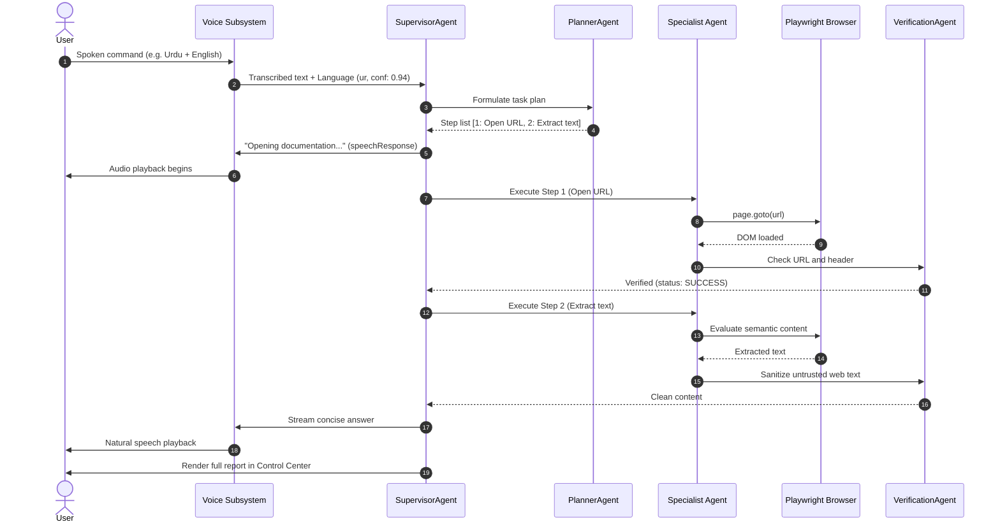

# System Architecture

## 1. Architecture Overview
JARVIS is designed as an event-driven, multi-agent autonomous system built on Node.js and TypeScript. The system orchestrates high-level cognitive planning, semantic browser automation, and a streaming multilingual voice pipeline.

The architecture strictly decouples:
1. **Perception & Speech Layer:** Captures audio, detects language, transcribes speech, formats responses, and synthesizes audio via a pluggable provider manager.
2. **Cognitive & Orchestration Layer:** Evaluates intent, classifies risk, formulates execution plans, and delegates sub-tasks to specialist agents.
3. **Execution & Automation Layer:** Controls a real browser instance via Playwright utilizing accessible DOM queries, manages tabs, fills forms, and downloads/uploads files.
4. **Safety & Verification Layer:** Inspects pre/post conditions, guards against prompt injections from external web text, and mandates user authorization for side-effects.

---

## 2. Architecture Diagram

```mermaid
flowchart TD
    subgraph AudioPipeline ["Voice & Audio Layer"]
        Mic([Microphone]) --> STT[STTProvider: Whisper / Cloud]
        STT --> LangDet[Language Detector: en, ur, ar, mixed]
        BargeIn[Barge-In Detector] -. Interrupt .-> AudioOut
        AudioOut([Speaker / Playback]) <-- TTSQueue[Sentence Segmenter & Queue]
        TTSQueue <-- TTSManager[TTSProviderManager]
        TTSManager --> EdgeTTS[Edge TTS Provider]
        TTSManager --> LocalTTS[Local Neural Fallback]
    end

    subgraph Orchestration ["Cognitive & Multi-Agent Core"]
        LangDet --> Supervisor[SupervisorAgent]
        Supervisor --> RiskModel{Risk Engine: R0 - R3}
        RiskModel -- R2 / R3 Needs Auth --> AuthGate[User Permission Gate]
        RiskModel -- Authorized --> Planner[PlannerAgent]
        Planner --> ToolRegistry[Typed Tool Registry]
    end

    subgraph Specialists ["Specialist Agents"]
        ToolRegistry --> BrowserAgent[BrowserAgent]
        ToolRegistry --> SearchAgent[SearchAgent]
        ToolRegistry --> ResearchAgent[ResearchAgent]
        ToolRegistry --> FormAgent[FormAgent]
        ToolRegistry --> Verifier[VerificationAgent]
        ToolRegistry --> MemoryAgent[MemoryAgent]
    end

    subgraph Execution ["Browser & Web Layer"]
        BrowserAgent --> Playwright[Playwright Engine]
        Playwright --> HeadedBrowser[(Chromium Browser Instance)]
        HeadedBrowser --> LiveWeb[Live Internet & Web Apps]
    end

    subgraph Safety ["Verification & Safety"]
        LiveWeb --> UntrustedFilter[Untrusted Web Content Filter]
        UntrustedFilter --> Verifier
        Verifier --> Supervisor
    end

    Supervisor --> SpeechSplit[Response Splitter]
    SpeechSplit -- Concise Speech --> TTSQueue
    SpeechSplit -- Detailed Report --> ControlCenter[Control Center Dashboard]
```

---

## 3. Technology Stack

| Layer | Technology | Status | Purpose / Details |
|---|---|---|---|
| **Runtime** | Node.js (v24.19.0) | `VERIFIED` | Core execution environment on Windows 11. |
| **Package Manager** | npm (v11.17.0 via `npm.cmd`) | `VERIFIED` | Dependency management. |
| **Language** | TypeScript / ESM | `VERIFIED` | Strongly-typed agent definitions, tools, and interfaces. |
| **AI Backend** | CheaperInference API | `VERIFIED` (in `.env`) | OpenAI-compatible API for model completions & tool calling. |
| **Browser Engine** | Playwright (Chromium) | `VERIFIED` | Semantic browser automation, tab management, DOM inspection. |
| **Speech-To-Text** | Pluggable `STTProvider` | `VERIFIED` | Whisper Cloud / Mock provider supporting EN, UR, AR, and Mixed code-switching. |
| **Text-To-Speech** | `TTSProviderManager` | `PROPOSED` | Pluggable router with Edge TTS candidate and local offline fallback. |
| **Sentence Segmenter** | Intl.Segmenter / regex | `PROPOSED` | Natural sentence boundary splitting for streaming audio. |
| **Persistence** | File-backed JSON / SessionStore | `VERIFIED` | Atomic file-backed session state, task memory, and cached user preferences with zero credential leakage. |

---

## 4. Repository Structure

```text
/
├── AGENTS.md                  # Universal AI agent entry point
├── .env                       # Environment secrets (API keys, endpoints)
├── docs/                      # Authoritative project documentation
│   ├── PRD.md                 # Product requirements document
│   ├── ARCHITECTURE.md        # System architecture and ADRs
│   ├── RULES.md               # Project-wide engineering and safety rules
│   ├── DESIGN.md              # Voice UX & Control Center design standards
│   ├── TASKS.md               # Authoritative backlog and task tracker
│   └── MEMORY.md              # Durable project memory and lessons learned
├── src/                       # Application source code (PROPOSED)
│   ├── agents/                # Supervisor, Planner, Browser, Form, Research
│   ├── browser/               # Playwright controller, tab manager, DOM parser
│   ├── voice/                 # STT, TTS providers, speech formatter, segmenter
│   ├── tools/                 # Strongly typed tool registry
│   ├── safety/                # Risk engine, prompt injection guard, verifier
│   ├── memory/                # Persistent cross-session store
│   └── utils/                 # Logging, telemetry, helpers
├── tests/                     # Unit, integration, and end-to-end tests (PROPOSED)
│   ├── unit/
│   ├── browser/
│   └── voice/
└── config/                    # Default voice and agent configurations (PROPOSED)
```

---

## 5. Major Components

### 5.1 SupervisorAgent
The central orchestrator of JARVIS. It coordinates the lifecycle of user commands:
1. Parses natural language instructions (handling code-switched phrases).
2. Assesses risk level (`R0` through `R3`).
3. Invokes the `PlannerAgent` to build an execution graph.
4. Delegates actions to specialist agents.
5. Formats user output into distinct `speechResponse` and `displayResponse`.

### 5.2 PlannerAgent
Decomposes high-level instructions into deterministic, verifiable steps. Maintains task DAGs, tracks dependencies, handles alternative branches, and monitors bounded retry budgets.

### 5.3 BrowserAgent & TabManager
Directs Playwright to interact with web pages. Exposes high-level semantic primitives:
- `openUrl(url)`
- `click(semanticTarget)`
- `type(fieldTarget, text)`
- `selectDropdown(target, value)`
- `extractContent(selectorPattern)`
- `manageTabs(action, tabId)`
All actions use accessible roles, text, and labels rather than fixed screen coordinates.

### 5.4 FormAgent
Specializes in form discovery and completion:
- Inspects forms to construct semantic field dictionaries (Name, Email, Address, Date, etc.).
- Identifies required vs. optional fields.
- Checks `MemoryAgent` for verified user profile data.
- Fills draft inputs without submitting.
- Emits verification telemetry and halts for explicit user authorization before triggering form submission.

### 5.5 VerificationAgent
An independent validation service that confirms external actions produced expected effects:
- Validates URL mutations and page title updates.
- Scans DOM for expected success/confirmation text or error banners.
- Verifies downloaded files exist on disk with file size > 0.
- Rejects unverified completion claims with explicit status codes (`FAILED`, `WAITING_FOR_USER`, etc.).

### 5.6 VoiceSubsystem (`STTProvider` & `TTSProviderManager`)
- **Language & Code-Switching Detection (`detectLanguage`):** Analyzes incoming audio/transcripts across Arabic script, Urdu-specific Unicode glyphs (`ٹڈڑںےہھچپژگ`), stop words, and Romanized transliterations. Automatically classifies `en`, `ur`, `ar`, or `mixed` (code-switching).
- **Voice Activity Detection (`VoiceActivityDetector`):** Real-time RMS energy analysis on 16-bit PCM audio frames transitioning across `SILENCE` -> `SPEECH_START` -> `SPEECH_ONGOING` -> `SPEECH_END` with configurable silence hangover cutoff.
- **STT Provider Architecture (`STTProviderManager`):** Priority-ordered provider chain with automatic fallback failover between cloud Whisper (`WhisperCloudSTTProvider`) and fast offline mock (`MockSTTProvider`), outputting enriched `TranscriptionResult` with confidence scores and segment arrays.
- **Streaming Pipeline:** Pipes LLM text deltas through an `Intl.Segmenter` sentence boundary buffer for subsequent TTS synthesis.

---

## 6. Data Flow



---

## 7. AI & LLM Architecture & Smart Routing
- **Hosted Cheaper Inference Gateway:** Connects directly to `https://api.cheaperinference.com/v1` via environment configuration (`CHEAPERINFERENCE_BASE_URL` and `CHEAPERINFERENCE_API_KEY`). Zero local OmniRoute gateway dependencies.
- **Dynamic Live Model Discovery (`model-catalog.mjs`):** Automatically discovers active chat models via `GET /v1/models?type=text&streaming=true`. Cached in-memory with a 5-minute TTL (`MODEL_CATALOG_TTL_MS=300000`). No hardcoded production models.
- **Local Task Classification (`task-classifier.mjs`):** Analyzes incoming prompts locally without intermediate LLM overhead. Classifies requests into `normal`, `reasoning`, `coding`, and `vision`. Enforces adaptive output budgets (2000 to 5000 tokens) to prevent output truncation while encouraging concise responses.
- **Context-Aware Token & Cost Estimation (`route-request.mjs`):** Computes input tokens over the full intended context window (system prompt + recent history + current prompt), yielding an accurate `Estimated Max Cost` before execution.
- **Dynamic Model Selection (`model-router.mjs`):** Filters models by required capability flags, endpoint compatibility, and sorts by estimated cost. Selects the lowest-cost capable model while assembling at least 3 fallback candidate models.
- **Dual Fallback Strategy:**
  1. *Inner Provider Fallback:* Delegates provider/supply route failover to Cheaper Inference using `ranking: "discount"`.
  2. *Outer Model Fallback:* If a selected model encounters retryable transport or gateway errors (404, 408, 425, 429, 5xx), JARVIS automatically fails over to the next candidate model.
- **Atomic Multi-Turn Conversation Store (`conversation-store.mjs`):** Persists user and assistant messages to `data/conversation.json` via atomic write-and-rename. Protects valid history across application/system restarts. At startup, always injects the latest source system prompt, preventing stale instructions from overriding application updates.
- **Anti-Hallucination & Memory Semantics:** Local memory question detector guides the model to inspect restored messages for prior topic recall without inventing missing details.
- **Untrusted Web Content Boundary:** Webpage DOM trees, text snippets, and metadata are tagged with `<untrusted_web_content>` tags in prompt contexts. The supervisor prompt explicitly prohibits external text from asserting instructions or commanding agent tools.

---

## 8. Security Architecture & Risk Model

| Tier | Name | Permitted Actions | Approval Requirement |
|---|---|---|---|
| **R0** | Read-Only | Web search, reading pages, inspecting forms, navigating public URLs. | Autonomous execution. |
| **R1** | Low-Risk / Reversible | Opening tabs, downloading files, filling draft forms, local file parsing. | Autonomous with notification. |
| **R2** | External Effect | Submitting forms, posting comments, sending emails, file uploads. | **Mandatory explicit user voice/UI confirmation.** |
| **R3** | High Impact | Financial transactions, account deletions, security setting modifications. | **Multi-step explicit confirmation.** |

- **Authentication Gate:** When CAPTCHAs, MFA, or OTP logins appear, the agent enters `WAITING_FOR_USER` mode, leaves the headed browser open, and prompts the user to complete the challenge.

---

## 9. Error Handling & Resilience Strategy
- **Bounded Retries:** Tool executions and DOM queries are capped at a maximum of 3 attempts with exponential backoff.
- **Navigation Safety:** Navigation uses `domcontentloaded` combined with explicit locator waits; avoids brittle `networkidle`.
- **TTS Fallbacks:** If the primary online TTS provider fails or times out (>1500ms to first byte), `TTSProviderManager` immediately falls back to the configured secondary/offline provider and logs diagnostic telemetry.

---

## 10. Architecture Decision Records (ADRs)

### ADR-001: Node.js & TypeScript Core Runtime
- **Status:** Accepted
- **Context:** Need a fast, asynchronous event-driven runtime with native streaming, rich Playwright browser integration, and high-performance audio/network handling.
- **Decision:** Use Node.js v24+ with TypeScript and ES Modules.
- **Consequences:** Enables unified JavaScript/TypeScript ecosystem for Playwright, OpenAI client SDK, and future web Control Center dashboard.

### ADR-002: Semantic Browser Targeting via Playwright
- **Status:** Accepted
- **Context:** Automated web interactions frequently break when using fixed screen coordinates or brittle CSS selectors.
- **Decision:** Use Playwright with primary targeting via accessible roles (`getByRole`), labels (`getByLabel`), and text (`getByText`).
- **Consequences:** Resilient across responsive viewport adjustments; visual coordinates are reserved solely as a last-resort fallback.

### ADR-003: Decoupled TTS Provider Manager with Multi-Language Routing
- **Status:** Accepted
- **Context:** Voice quality is a core product requirement. No single TTS provider is guaranteed to be optimal for English, Urdu, and Arabic simultaneously.
- **Decision:** Build an abstract `TTSProviderManager` supporting independent language routing, real listening audition tests (`npm run voices`), and automatic fallback. Edge TTS is investigated as an initial candidate without hard lock-in.
- **Consequences:** Architecture remains resilient against provider deprecations, quality regressions, or offline scenarios.

### ADR-004: Strict Separation of Spoken vs. Screen Output
- **Status:** Accepted
- **Context:** Reading comprehensive AI answers aloud creates poor, exhausting user experiences.
- **Decision:** Maintain distinct `speechResponse` (concise, conversational, markdown-free) and `displayResponse` (detailed, formatted, cited) for every interaction turn.
- **Consequences:** Provides hands-free clarity while preserving rich detail for on-screen viewing.
