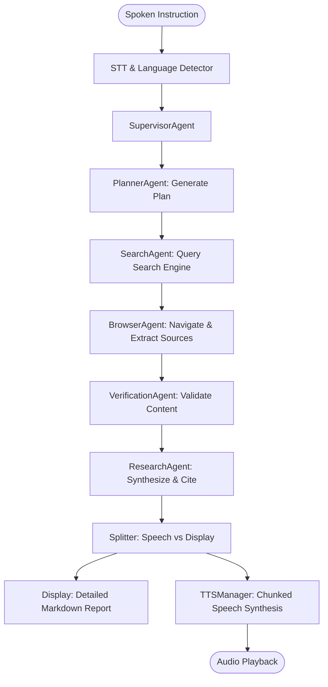
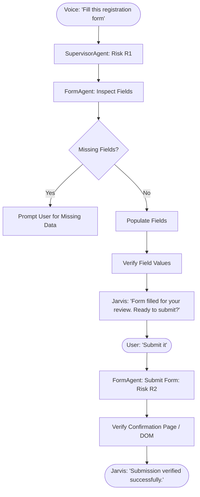

# Product Requirements Document (PRD)

## 1. Project Identity
- **Project Name:** JARVIS — Voice-First AI Assistant
- **Subtitle:** Internet + Human-Like Browser Control
- **Project Type:** Voice-First Autonomous Agent System (Desktop / Node.js)
- **Current Version:** 0.1.0 (Scaffolding / Pre-Alpha)
- **Status:** Bootstrapping / Architectural Definition
- **Short Description:** An advanced voice-first AI assistant capable of understanding natural spoken instructions (English, Urdu, Arabic), reasoning about goals, planning multi-step tasks, executing human-like browser automation, interacting with websites and forms, verifying real-world effects, and speaking back with natural human-like voice synthesis.

---

## 2. Problem Statement
Traditional AI chatbots are locked inside text boxes. They cannot act directly on the live web, navigate complex web applications, download files, fill forms, or interact through hands-free, natural human voice conversation across multiple languages (including Urdu, Arabic, and code-switched speech). Users are forced to manually perform repetitive browser research, form filling, document extraction, and file management tasks.

JARVIS bridges the gap between conversational AI and real-world digital execution by combining a supervisor-specialist multi-agent system, an autonomous Playwright-driven browser controller, and an expressive, low-latency multilingual speech pipeline.

---

## 3. Target Users
- **Primary User:** Knowledge workers, developers, and bilingual/multilingual users who manage complex web research, documentation workflows, and automated tasks.
- **Language Profiles:** Native and fluent speakers of English, Urdu, and Arabic, frequently using mixed technical English terminology within Urdu and Arabic sentences.
- **Operating Context:** Windows desktop workstation with microphone, audio output, and modern web browser access.

---

## 4. Goals

### Primary Goals
1. **Real Action Capability:** Perform verifiable actions on the internet and web applications (click, type, navigate, search, download, upload, fill forms).
2. **First-Class Multilingual Voice:** Seamlessly comprehend and converse in English, Urdu, and Arabic, automatically detecting spoken language and handling code-switching with preserved technical terms.
3. **Natural Human-Like Speech:** Voice synthesis that sounds warm, expressive, calm, and conversational rather than robotic or synthetic.
4. **Verifiable & Anti-Hallucinatory:** Never claim completion without concrete state evidence (URL change, DOM confirmation, non-zero file size). Strict observe-decide-act-verify cycle.
5. **Supervisor-Specialist Architecture:** Decompose complex commands into structured plans delegated to specialist agents (Search, Research, Form, Browser, Verification, Memory).

### Secondary Goals
1. **Interactive Control Center:** Observability UI showing active agents, browser tabs, execution plans, speech telemetry, and diagnostic logs.
2. **Barge-In / Interruption:** Stop audio playback and cancel pending speech queues instantly when the user speaks a wake word or command.
3. **Safe Authentication Handoff:** Clean pause-and-handoff mechanism for CAPTCHAs, OTPs, and multi-factor authentication.
4. **Resilient Provider Fallbacks:** Automatic failover between primary online TTS (e.g. Edge TTS candidate) and local/offline neural fallback engines.

---

## 5. Non-Goals
- **Bypassing Security Systems:** JARVIS will never attempt to break CAPTCHAs, bypass Cloudflare bot checks, or crack authentication.
- **Credential Storage in Plain Memory:** No passwords, OTPs, session cookies, or payment card numbers will be stored in persistent AI memory.
- **Unbounded Web Crawling:** JARVIS will not act as a generic high-volume scraper; actions are focused, bounded, and task-specific.
- **Monolithic LLM Execution:** JARVIS is not a single giant prompt; all tasks run through modular, typed tools and specialist agents.

---

## 6. Core Features

### 6.1 Multilingual Voice & Speech Pipeline
- **Languages:** English (`en`), Urdu (`ur`), Arabic (`ar`), and code-switched (`mixed`).
- **Language Detection:** Spoken language identification with confidence scoring, maintaining conversational context across turns.
- **TTS Engine & Provider Manager:** Decoupled `TTSProviderManager` capable of language-specific routing. Investigates Microsoft Edge Natural/Neural TTS as primary candidate, with rigorous real-listening benchmarks against alternative hosted and local offline engines.
- **Speech Optimization (`prepareForSpeech`):** Separates user-facing conversational speech (`speechResponse`) from comprehensive on-screen reports (`displayResponse`). Strips markdown, URLs, JSON, and technical telemetry from speech.
- **Streaming Sentence Chunking:** Pipeline LLM token stream into sentence segmenters to begin audio synthesis immediately on first complete sentence.
- **Barge-In:** Instant playback halt, queue flush, and microphone activation upon user interruption.
- **Wake Word:** Configurable detection ("Hey Jarvis", "Jarvis") plus Push-to-Talk and continuous modes.

### 6.2 Browser Automation Subsystem
- **Engine:** Playwright automation driving Chromium/Chrome.
- **Semantic Targeting:** Primary targeting using accessible roles, accessible names, labels, and text rather than brittle visual coordinates `(x, y)`.
- **Navigation & Control:** Open URL, click, double click, right click, type, clear, scroll, select dropdowns, check/uncheck checkboxes, radio selection, file upload/download, tab switching, and dialog/cookie banner handling.
- **Tab State Tracking:** Real-time registry of open tabs, active URLs, page titles, and associated task contexts.
- **Bounded Wait Strategies:** Avoids fragile `networkidle`; utilizes DOM readiness, element visibility, and explicit state verification with strict timeouts.

### 6.3 Specialist Agent Hierarchy
- **SupervisorAgent:** Intent analysis, risk assessment, plan creation, agent orchestration, and final response synthesis.
- **PlannerAgent:** Decomposes complex multi-step user tasks into DAG-based actionable plans with recovery contingencies.
- **BrowserAgent:** Executes low-level browser primitives with semantic selectors.
- **SearchAgent:** Formulates search queries across search engines and within specific target sites.
- **ResearchAgent:** Synthesizes multi-source research, compares conflicting information, and preserves source citations.
- **FormAgent:** Inspects form semantics, maps user profile data to fields, asks only for missing inputs, fills drafts, and prepares forms for user review.
- **VerificationAgent:** Inspects pre/post conditions to validate execution truth before reporting success.
- **MemoryAgent:** Manages cross-session persistent task history, user preferences, and workflow states without storing credentials.

### 6.4 Safety, Risk & Verification Framework
- **Risk Tiers:**
  - `R0 (Read-Only)`: Web search, reading pages, inspecting forms, public navigation.
  - `R1 (Low-Risk / Reversible)`: Opening tabs, downloading files, filling draft forms.
  - `R2 (External Effect)`: Submitting forms, sending messages, posting data (requires explicit user authorization).
  - `R3 (High Impact)`: Financial transactions, account deletions, security settings (strict multi-step approval).
- **Prompt Injection Defense:** External webpage DOM and text are treated as strictly untrusted external data. Webpage content cannot issue privileged agent instructions.
- **State Verification:** Success is reported only when backed by observable evidence (URL change, confirmation banner, verified file on disk).

---

## 7. User Flows

### Flow 1: Web Research & Summarization

### Flow 2: Form Filling with Safe Separation

---

## 8. Functional Requirements

| ID | Requirement | Priority |
|---|---|---|
| **FR-001** | The system must accept spoken user input in English, Urdu, and Arabic. | P0 |
| **FR-002** | The system must automatically identify the spoken language (`en`, `ur`, `ar`, `mixed`) with confidence scores. | P0 |
| **FR-003** | The system must sustain conversation in the detected language unless explicitly instructed to switch. | P0 |
| **FR-004** | The system must synthesize natural speech in English, Urdu, and Arabic using a pluggable TTS provider manager. | P0 |
| **FR-005** | The TTS manager must support language-specific voice routing and automatic fallback to secondary/offline engines. | P0 |
| **FR-006** | The system must provide a voice audition tool (`npm run voices`) to benchmark and select voices using standardized test sentences. | P1 |
| **FR-007** | The system must filter speech output through `prepareForSpeech()` to strip markdown, raw URLs, code blocks, and JSON. | P0 |
| **FR-008** | The system must stream LLM output through a sentence segmenter to begin TTS playback on the first complete sentence. | P0 |
| **FR-009** | The system must support barge-in / interruption, cancelling queued audio immediately when user speaks. | P0 |
| **FR-010** | The system must support wake word activation ("Hey Jarvis", "Jarvis") and Push-to-Talk mode. | P1 |
| **FR-011** | The system must control a browser via Playwright using accessible roles, labels, and text rather than screen coordinates. | P0 |
| **FR-012** | The browser agent must manage multiple tabs, tracking active URLs, titles, and task associations. | P1 |
| **FR-013** | The system must enforce the Observe-Decide-Act-Observe-Verify execution cycle for all browser operations. | P0 |
| **FR-014** | The system must never report action success without concrete evidence (URL change, DOM text, file existence). | P0 |
| **FR-015** | The system must enforce risk tiers (R0, R1, R2, R3) and require explicit user authorization before R2/R3 actions. | P0 |
| **FR-016** | The system must strictly decouple form population (R1) from form submission (R2). | P0 |
| **FR-017** | The system must treat all webpage text as untrusted data to prevent prompt injection attacks. | P0 |
| **FR-018** | The system must pause and hand off to the user upon encountering CAPTCHA, OTP, MFA, or biometric gates. | P0 |
| **FR-019** | The system must verify downloaded files on the filesystem (existence, path, size > 0) before reporting success. | P1 |
| **FR-020** | The system must enforce explicit timeouts and bounded retries on all agent loops and browser waits. | P0 |
| **FR-021** | The system must provide an interactive Control Center displaying telemetry, active plans, browser state, and logs. | P2 |

---

## 9. Non-Functional Requirements

- **NFR-001 (Latency):** Time to first speakable sentence from LLM generation < 1200ms; TTS synthesis to first audio chunk < 800ms.
- **NFR-002 (Voice Quality):** Speech must score high in naturalness, warmth, and proper pronunciation in English, Urdu, and Arabic.
- **NFR-003 (Reliability):** Automated browser operations must recover from temporary DOM shifts using semantic alternatives without entering infinite loops.
- **NFR-004 (Security):** Zero persistence of authentication secrets, passwords, or session tokens in plain AI memory files.
- **NFR-005 (Platform Compatibility):** First-class support for Windows 11 x64, Node.js v24+, with standard microphone and audio devices.
- **NFR-006 (Extensibility):** Fully modular architecture allowing new tools and specialist agents to be registered without touching core orchestration.

---

## 10. Constraints
- **Operating System:** Windows 11 x64.
- **Runtime:** Node.js v24.19.0 with npm 11.17.0 (invoked via `npm.cmd` due to execution policy constraints).
- **AI Backend:** OpenAI-compatible API configured via `.env` (`CHEAPERINFERENCE_API_KEY`, `CHEAPERINFERENCE_BASE_URL`).
- **Browser Automation:** Headed/headless Chromium driven by Playwright.

---

## 11. Acceptance Criteria
1. System passes comprehensive test suites verifying each phase before progressing to the next.
2. Verified multi-turn voice interaction across English, Urdu, and Arabic without language degradation.
3. Successful autonomous multi-step web task: search web for topic -> open official page -> extract specific section -> summarize on screen + speak concise takeaway -> download referenced PDF -> verify file size > 0 on disk.
4. Successful safe form workflow: inspect test form -> populate fields -> halt for user review -> submit only after explicit user command -> verify confirmation.
5. Zero unhandled promise rejections or infinite loops under network failures or missing DOM selectors.
